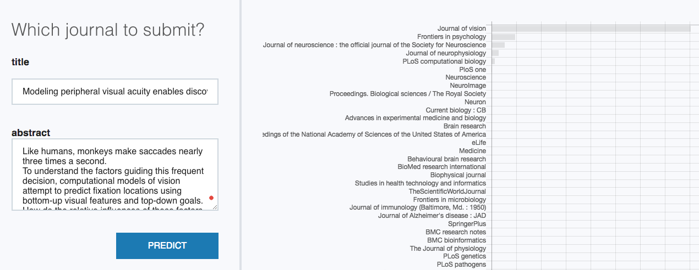

# Introduction to AllenNLP

Tutorial of [`AllenNLP`](https://allennlp.org/) at [Kording Lab](http://kordinglab.com) (November, 2018).
Here, we implement deep learning model for text classification using AllenNLP.
We will go through basic concept on how to implement
classifier and how to use the AllenNLP library. All the materials are listed below.


## Materials

- `allennlp_tutorial.pdf` is the slide for the lab teaching
- `allennlp_tutorial.ipynb` is the Jupyter notebook for the AllenNLP example (predict which venue should we submit the paper to)
- `venue` folder is the folder that we make AllenNLP as a library. To train the model, you can run the following command


```bash
allennlp train example_training.json -s output --include-package venue
```

The file `example_training.json` contains specification for the training e.g.
`"cuda_device": -1` means using CPU, `"num_epochs": 40` means train for 40 epochs.

You can also see the experiment output via TensorBoard by running

```bash
tensorboard --logdir output
```

More information can be found at [allenai/allennlp](https://github.com/allenai/allennlp)
and [allenai/allennlp-as-a-library-example](https://github.com/allenai/allennlp-as-a-library-example)


## Predict which journal to submit in MEDLINE

We do a fun experiment where we train the same model to classify
publications from sample 110 journals from MEDLINE. To train the model, 
you can run the script below. We got an accuracy of 64.9 percent on validation dataset 
(not too bad!). 

```bash
allennlp train example_training_110venue.json -s output_110venue --include-package venue
```

You can see how to use the model in the last section of `allennlp_tutorial.ipynb`. 
Alternatively, you can also run the demo locally by downloading the trained model and run `allennlp.service.server_simple` as follows

```bash
wget https://s3-us-west-2.amazonaws.com/allennlp-tutorial/model.tar.gz
python -m allennlp.service.server_simple \
    --archive-path model.tar.gz \
    --predictor venue_predictor \
    --include-package venue \
    --field-name title \
    --field-name paperAbstract \
    --static-dir static_html
```

This will produce the bar chart output of venues' probability.




## Installation

Here is a list of dependencies for the demo:

```bash
pytorch >= 0.4
spacy
allennlp >= 0.7
```

You can install these packages using `conda` and `pip` commands as follows:

```bash
conda install pytorch torchvision -c pytorch
conda install -c conda-forge spacy
pip install "allennlp>=0.7"
```